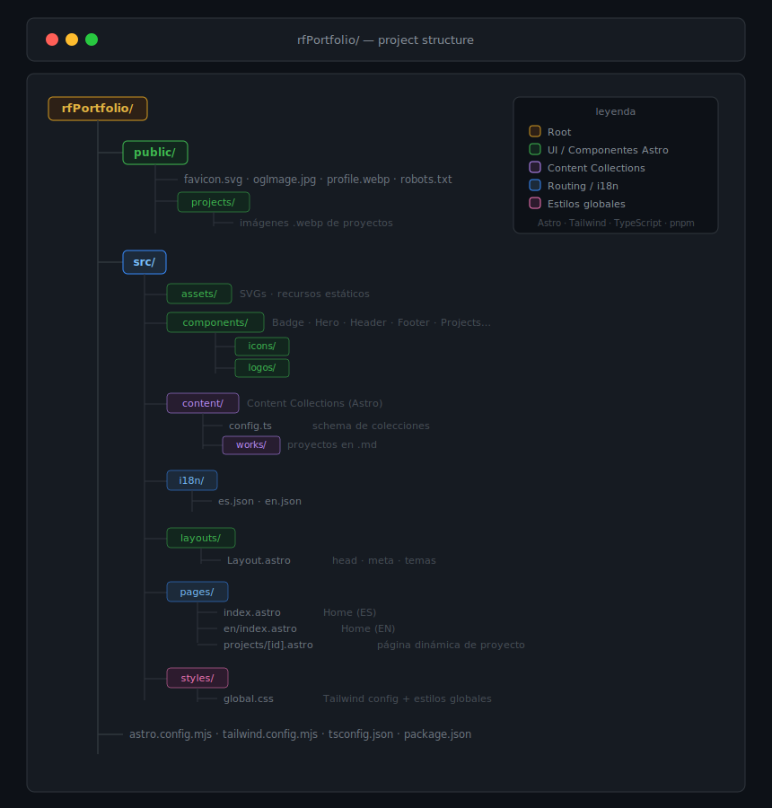

# rfPortfolio

Portafolio personal de **Rodolfo Fuentealba** — Diseñador UX/UI & Frontend Developer con +9 años de experiencia, basado en Valparaíso, Chile.

Construido con [Astro 5](https://astro.build/), [Tailwind CSS 4](https://tailwindcss.com/) y TypeScript. Soporta internacionalización (español/inglés), modo oscuro, View Transitions y GSAP para animaciones.

## Stack

| Categoría | Tecnologías |
|-----------|-------------|
| Framework | [Astro](https://astro.build/) — Islands architecture |
| Estilos | [Tailwind CSS v4](https://tailwindcss.com/) + `@tailwindcss/typography` |
| Lenguaje | TypeScript |
| Animaciones | GSAP + ScrollReveal |
| Fuentes | Onest Variable (via Fontsource) |
| i18n | Sistema propio basado en JSON (es/en) |
| Analytics | [Vercel Analytics](https://vercel.com/analytics) |
| Sitemap | `@astrojs/sitemap` |
| Deploy | [Vercel](https://vercel.com) |

## Estructura del sitio

## Rutas

| Ruta | Descripción |
|------|-------------|
| `/` | Home — español |
| `/en` | Home — inglés |
| `/projects/[id]` | Página detalle de proyecto |

## Comandos

Todos los comandos se ejecutan desde la raíz del proyecto con `pnpm`:

| Comando | Acción |
|---------|--------|
| `pnpm install` | Instala dependencias |
| `pnpm dev` | Inicia servidor de desarrollo en `localhost:4321` |
| `pnpm build` | Build producción → `./dist/` |
| `pnpm preview` | Previsualiza el build localmente |
| `pnpm check` | Type-check con `astro check` |
| `pnpm astro ...` | CLI de Astro |

## Internacionalización

El sitio detecta el idioma del navegador y redirige automáticamente. Se puede alternar entre ES/EN mediante el `LanguageSwitch` en el header.

## Deploy

El sitio está desplegado en **[rodfuentealba.com](https://www.rodfuentealba.com)** vía Vercel, con generación automática de sitemap.
